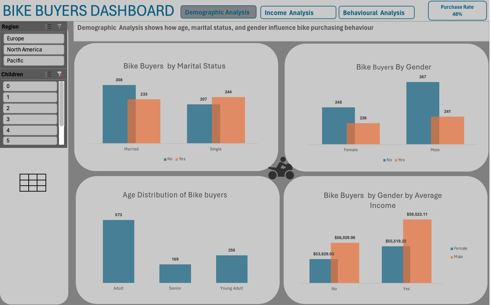
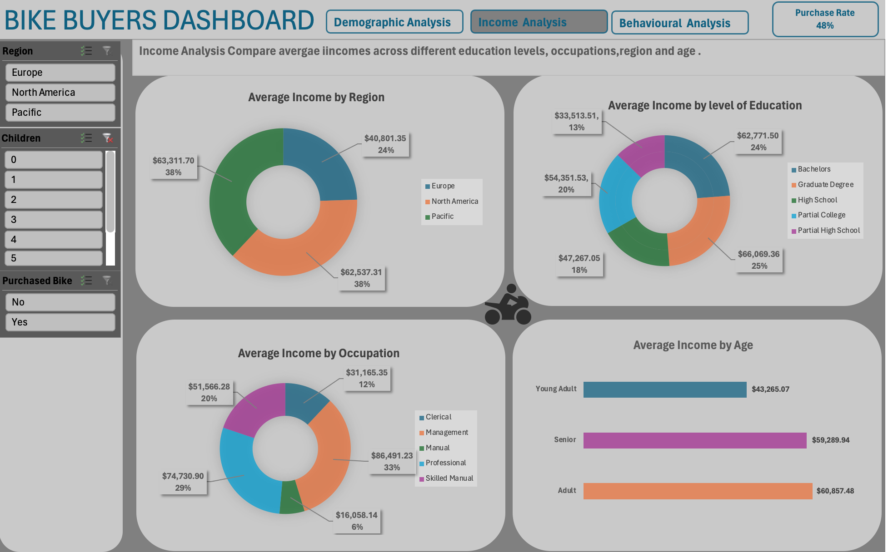
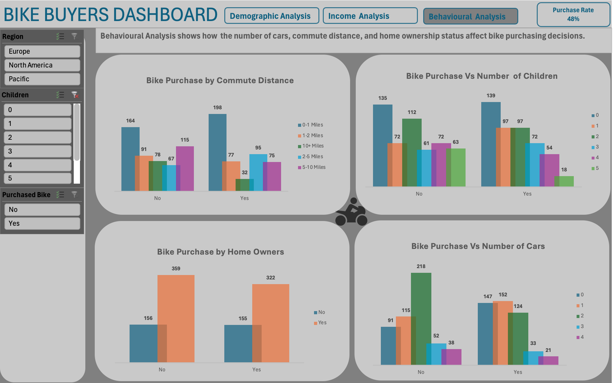

# Bike-Buyers-Analysis-using-Excel
This Excel project provides a comprehensive analysis and dashboard for bike buyers, based on the data that was provided.  
The dataset contains information about 1000 different customers. The analysis covers different factors that might influence the decision of customers bike purchase.  
The project utilized data cleaning, pivot tables, and visualizations. The goal is to provide a user-friendly dashboard where users can interact with the data,   
exploring bike sales insights based on various factors.

## Data Overview 
Dataset Used - [Kaggle](https://www.kaggle.com/datasets/heeraldedhia/bike-buyers)
•	The project utilizes the Bike Buyers 1000 dataset in the link above.  
The dataset includes information on Buyer's  
ID,   
Marital Status,  
Gender,  
Income,  
Children (number of children),  
Education level,  
Occupation,  
Homeowner,  
Cars,  
Commute Distance,  
Region,  
Age,  
Purchased Bike  

## Excel Functions Used :
IF,ISBLANK,INDEXMATCH 

# Key Steps in the Project
## Create Working Sheet:   
Copy raw data to another  work sheet for data cleaning and manipulation, keeping the original data intact.
## Data Cleaning:   
**Identify and remove duplicates**,    
**Handle NA values**; Mean value was used to replace NA values in the numeric column and in categorical columns the mode was used to replace NA values., 
**Standardize data format** ,    
**Categorize Data**; The age column consists of different age range, these ages were grouped into three age brackets   
0-17: Child  
18-35: Young Adult  
36-55: Adult  
56 and above: Senior  

## Data Exploration
A detailed exploration of the dataset was conducted to understand the distribution and relationships between different variables.
Demographic Overview  
•	Age Distribution: Visualized the age distribution to understand the age demographics of the users.  
•	Gender Distribution: Analyzed the gender distribution of the users.  
•	Marital Status: Examined the marital status distribution among users.  
•	Income Levels: Analyzed the income distribution to understand the financial background of the users.  

## Pivot Tables  
Utilized pivot tables to summarize and analyse data for visualization.
## Visualizations  
Built visualizations using charts to represent key insights.  
## Dashboard Creation  
Copy visualizations onto a dashboard sheet for a consolidated view.
## Chart Customization
Adjust chart titles, axis labels, and formatting for better clarity.

# Key Analysis Performed 

## Demographic Analysis   
Objective: To determine how age, marital status, and gender of the customers influence bike purchasing behaviour   
**Age Brackets** : Categorized users into age brackets and analysed bike purchase rates within each bracket 

**Gender** : Compared bike purchase rate between males and females.
**Marital status** : Analysed the influence of marital status on bike purchasing behaviour 

## Income Analysis   
Objective: To Compare Average income across different education levels, occupation, age and region of customers and whether they purchased a bike.

## Behavioural Analysis    
Objective: To determine how the number of cars, commute distance and home ownership status affects bike purchasing decisions.  

# Key findings

**Age Bracket Analysis**
Young Adults (18-35): Had the highest bike purchase rate.
Seniors (56+): Showed the lowest purchase rate.  
**Gender Analysis**
Males: Had a higher bike purchase rate compared to females.

**Income Analysis**
Customers from North America and Pacific regions have high average income, but of the three regions only pacific region has the higher tendency of purchasing a bike (purchase ratio). 

Customers with Graduate degrees and bachelor’s degrees had the highest average income and have higher purchase ratio to other education levels.  
The analysis indicate that higher education levels correlate with higher average income and a greater likelihood of purchasing bikes.

Customers with management roles had the highest average income, unfortunately they have a lower purchase ratio therefore they do not have high tendencies of purchasing a bike, customers in professional roles had a higher purchase ratio.

 **Behavioural Analysis**
From the data provided ,we can’t establish how numbers of cars , commute distance and home ownership status affects bike purchasing decisions.

## Dashboard 
The  interactive dashboard contains 3 different pages .  

# **Demographic Analysis**

# **Income Analysis**

# **Behavioural Analysis**

## Instructions for Use  

Download the dataset from the provided GitHub repository link.  
Explore the interactive dashboard to gain insights into bike buyers and sales  based on various demographics.  
Contribute or modify the project as needed for your specific requirements.

